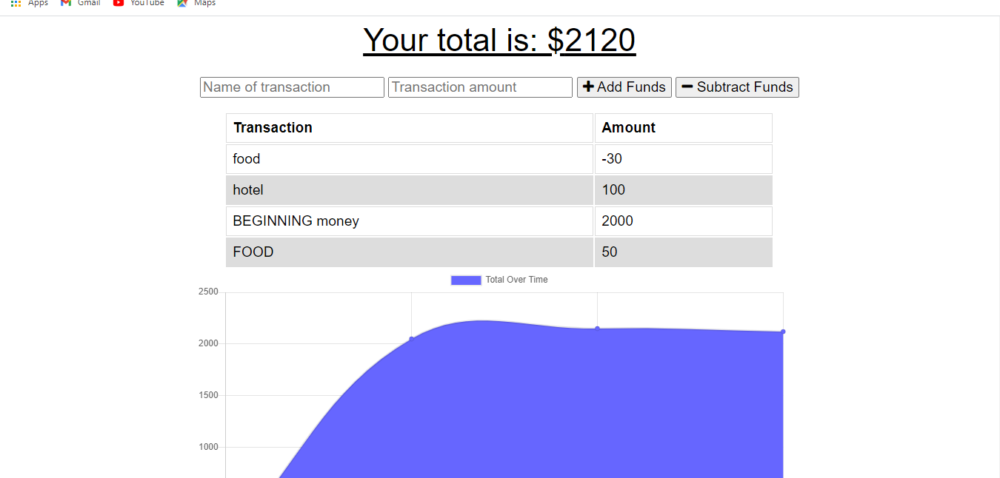

# show-me-the-money
# show-me-the-money 

# show-me-the-money 

#Table of Contents

-[Description](#description)
-[Usage](#useage)
-[Languages](#languages)
-[Colaborators](#colaborators)
-[License](#license)
-[Links](#links)
-[Questions](#questions)

 ## Description:
 
 This is a an application to help keep track of your budget anywhere at any time. With or with out internet connection.
 
 ## Usage:
 this is deployed on heroku so it doesn't need any installs. however, if you are pulling code off github please npm i before use. then npm start to start the app.

##languages
"compression"
"express"
"mongoose"
"morgan"

 ## Picture:
 
 
 ## License
 For more info about the License, click on the link below.

 ## Links
 Link to the GitHub 
[link](https://github.com/natashamullin/show-me-the-money)
Link to the deployed project
[link](https://secure-sea-56885.herokuapp.com/)

## Questions 
please reach me at my GubHub account or through Email if you have any questions
Natasha Mullin; [link](github.com/natashamullin)
[link](Natashamullin0826889@yahoo.com)

